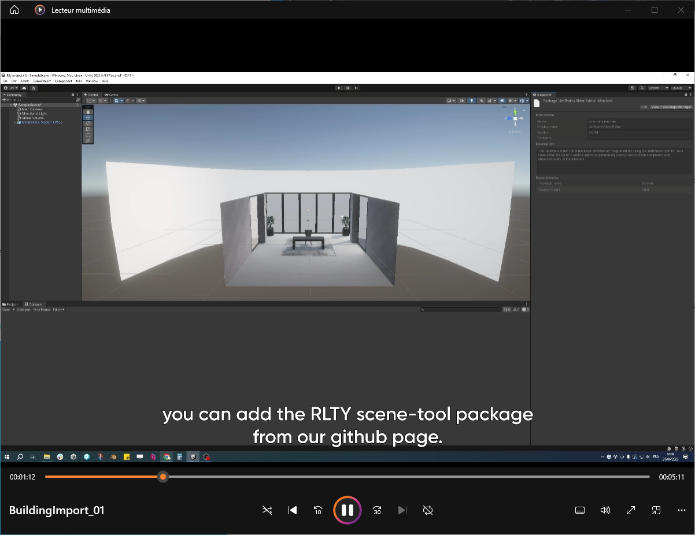

# RLTY Scenetools

This is a public package to build your own RLTY experiences.

## Installation

Use Unity 2021.3.4f1 - URP

 - Make sure you have a GitHub account. GitHub requiers you to authenticate to download a public package.
 - See **Insert tutorial video Link here**
 

